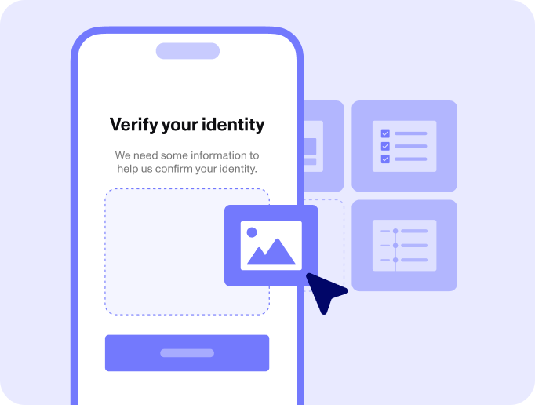

# Reach out to our team for a custom demo

Configurable solutions for any identity use case

Build your identity program using Persona’s world-class product offerings, starting at $0 for Lenny's listeners.

# Reach out to our team for a custom demo

Business email address\*

Phone number

InternationalAfghanistanÅland IslandsAlbaniaAlgeriaAmerican SamoaAndorraAngolaAnguillaAntigua and BarbudaArgentinaArmeniaArubaAscension IslandAustraliaAustriaAzerbaijanBahamasBahrainBangladeshBarbadosBelarusBelgiumBelizeBeninBermudaBhutanBoliviaBonaire, Sint Eustatius and SabaBosnia and HerzegovinaBotswanaBrazilBritish Indian Ocean TerritoryBrunei DarussalamBulgariaBurkina FasoBurundiCambodiaCameroonCanadaCape VerdeCayman IslandsCentral African RepublicChadChileChinaChristmas IslandCocos (Keeling) IslandsColombiaComorosCongoCongo, Democratic Republic of theCook IslandsCosta RicaCote d'IvoireCroatiaCubaCuraçaoCyprusCzech RepublicDenmarkDjiboutiDominicaDominican RepublicEcuadorEgyptEl SalvadorEquatorial GuineaEritreaEstoniaEthiopiaFalkland IslandsFaroe IslandsFederated States of MicronesiaFijiFinlandFranceFrench GuianaFrench PolynesiaGabonGambiaGeorgiaGermanyGhanaGibraltarGreeceGreenlandGrenadaGuadeloupeGuamGuatemalaGuernseyGuineaGuinea-BissauGuyanaHaitiHoly See (Vatican City State)HondurasHong KongHungaryIcelandIndiaIndonesiaIranIraqIrelandIsle of ManIsraelItalyJamaicaJapanJerseyJordanKazakhstanKenyaKiribatiKosovoKuwaitKyrgyzstanLaosLatviaLebanonLesothoLiberiaLibyaLiechtensteinLithuaniaLuxembourgMacaoMadagascarMalawiMalaysiaMaldivesMaliMaltaMarshall IslandsMartiniqueMauritaniaMauritiusMayotteMexicoMoldovaMonacoMongoliaMontenegroMontserratMoroccoMozambiqueMyanmarNamibiaNauruNepalNetherlandsNew CaledoniaNew ZealandNicaraguaNigerNigeriaNiueNorfolk IslandNorth KoreaNorth MacedoniaNorthern Mariana IslandsNorwayOmanPakistanPalauPalestinePanamaPapua New GuineaParaguayPeruPhilippinesPolandPortugalPuerto RicoQatarReunionRomaniaRussiaRwandaSaint BarthélemySaint HelenaSaint Kitts and NevisSaint LuciaSaint Martin (French Part)Saint Pierre and MiquelonSaint Vincent and the GrenadinesSamoaSan MarinoSao Tome and PrincipeSaudi ArabiaSenegalSerbiaSeychellesSierra LeoneSingaporeSint MaartenSlovakiaSloveniaSolomon IslandsSomaliaSouth AfricaSouth KoreaSouth SudanSpainSri LankaSudanSurinameSvalbard and Jan MayenSwazilandSwedenSwitzerlandSyriaTaiwanTajikistanTanzaniaThailandTimor-LesteTogoTokelauTongaTrinidad and TobagoTristan da CunhaTunisiaTurkeyTurkmenistanTurks and Caicos IslandsTuvaluUgandaUkraineUnited Arab EmiratesUnited KingdomUnited StatesUruguayUzbekistanVanuatuVenezuelaVietnamVirgin Islands, BritishVirgin Islands, U.S.Wallis and FutunaWestern SaharaYemenZambiaZimbabwe

Anything else?

Submit

By submitting this form, you agree to receive communications at the email address and phone number you provided. See our [Privacy Policy](./legal/privacy-policy.md) for more information about our privacy practices.

Trusted by startups and the world’s largest companies

Special offer for Lenny's listeners

## Eligible startups get limited access to Persona with 500 free services\* per month for one full year.

\*Program eligibility: All applications to the program are evaluated on intended use of Persona products and businesses must be a startup with less than $5M in funding raised, an independently owned and operated small business, and/or a business with less than 50 employees.

[Get started](https://app.withpersona.com/dashboard/register?utm_source=lenny&utm_medium=podcast&utm_audience=a&utm_campaign=acq_gen_ds)

## How it works

1

Configure

2

Adjust friction

3

Decide

4

Optimize

Build branded flows

Create branded user experiences with our visual editor and silently collect passive risk signals as they move through the flow.

## Use cases

Verify at any point of the customer life cycle

New user onboarding

Toggle description visibility

Keep your user base safe by adding known fraudsters and users who violate your terms of service to a blocklist and automatically deny future access.

Existing user reverification

Toggle description visibility

Confirm users' identities whenever it makes sense for your business — for example, every six months or during high-risk transactions.

Before issuing credentials

Toggle description visibility

Verify and authenticate users before you grant them updated permissions on your platform. 

Everything you need to build and maintain trust and safety on your platform

Government ID verification

Collect and verify your choice of government-issued IDs to identify users across 200+ countries and territories.

Mobile driver’s license (mDL) verification

Verify mobile driver’s licenses with a low-friction, high-assurance verification method.

Flow Editor

Build branded user flows to collect customer information — no code needed.

Passive signals

Silently assess risk with device fingerprints and other behavioral signals.

Age assurance

Comply with online safety regulations requiring age assurance, privacy, and consent.

Selfie liveness verification

Detect similar backgrounds in submitted selfies and compare against other signals with a selfie similarity check.

Graph

Uncover and block fraud rings or risky accounts that are connected.

Cases

Conduct investigations and maximize team productivity with a configurable case management hub.

Workflows

Automate decisions and follow-ups throughout the user life cycle.

## Integrated, dedicated, and comprehensive support

Persona offers customer support throughout the onboarding process as well as ongoing support.

“Once we defined our requirements for the Brex Cash onboarding flow, we evaluated a number of different providers. Persona was the right choice for us because of their geographical coverage, their focus on user experience, and the willingness of the team to closely partner with us to build the right integration for our needs.”

Thomas Piani

Product lead at Brex

[Get a demo](#contact)

### Discover more use cases

Twilio expedites KYB decisions while complying with regional regulations via a flexible and centralized system of record

Square Capital automatically verified Paycheck Protection Program loan applicants with Persona

Lime meets international compliance regulations & converts more riders with Persona’s global onboarding solution

## Security and privacy at our core

Trust is built on security and privacy. That’s why Persona adheres to the highest industry standards, maintaining compliance and certifications to safeguard you and your customers.

[Learn more](./security.md)

We're here to help

We're excited to learn more about your business and help you meet compliance, convert users and fight fraud easier.

# Reach out to our team for a custom demo

Business email address\*

Phone number

InternationalAfghanistanÅland IslandsAlbaniaAlgeriaAmerican SamoaAndorraAngolaAnguillaAntigua and BarbudaArgentinaArmeniaArubaAscension IslandAustraliaAustriaAzerbaijanBahamasBahrainBangladeshBarbadosBelarusBelgiumBelizeBeninBermudaBhutanBoliviaBonaire, Sint Eustatius and SabaBosnia and HerzegovinaBotswanaBrazilBritish Indian Ocean TerritoryBrunei DarussalamBulgariaBurkina FasoBurundiCambodiaCameroonCanadaCape VerdeCayman IslandsCentral African RepublicChadChileChinaChristmas IslandCocos (Keeling) IslandsColombiaComorosCongoCongo, Democratic Republic of theCook IslandsCosta RicaCote d'IvoireCroatiaCubaCuraçaoCyprusCzech RepublicDenmarkDjiboutiDominicaDominican RepublicEcuadorEgyptEl SalvadorEquatorial GuineaEritreaEstoniaEthiopiaFalkland IslandsFaroe IslandsFederated States of MicronesiaFijiFinlandFranceFrench GuianaFrench PolynesiaGabonGambiaGeorgiaGermanyGhanaGibraltarGreeceGreenlandGrenadaGuadeloupeGuamGuatemalaGuernseyGuineaGuinea-BissauGuyanaHaitiHoly See (Vatican City State)HondurasHong KongHungaryIcelandIndiaIndonesiaIranIraqIrelandIsle of ManIsraelItalyJamaicaJapanJerseyJordanKazakhstanKenyaKiribatiKosovoKuwaitKyrgyzstanLaosLatviaLebanonLesothoLiberiaLibyaLiechtensteinLithuaniaLuxembourgMacaoMadagascarMalawiMalaysiaMaldivesMaliMaltaMarshall IslandsMartiniqueMauritaniaMauritiusMayotteMexicoMoldovaMonacoMongoliaMontenegroMontserratMoroccoMozambiqueMyanmarNamibiaNauruNepalNetherlandsNew CaledoniaNew ZealandNicaraguaNigerNigeriaNiueNorfolk IslandNorth KoreaNorth MacedoniaNorthern Mariana IslandsNorwayOmanPakistanPalauPalestinePanamaPapua New GuineaParaguayPeruPhilippinesPolandPortugalPuerto RicoQatarReunionRomaniaRussiaRwandaSaint BarthélemySaint HelenaSaint Kitts and NevisSaint LuciaSaint Martin (French Part)Saint Pierre and MiquelonSaint Vincent and the GrenadinesSamoaSan MarinoSao Tome and PrincipeSaudi ArabiaSenegalSerbiaSeychellesSierra LeoneSingaporeSint MaartenSlovakiaSloveniaSolomon IslandsSomaliaSouth AfricaSouth KoreaSouth SudanSpainSri LankaSudanSurinameSvalbard and Jan MayenSwazilandSwedenSwitzerlandSyriaTaiwanTajikistanTanzaniaThailandTimor-LesteTogoTokelauTongaTrinidad and TobagoTristan da CunhaTunisiaTurkeyTurkmenistanTurks and Caicos IslandsTuvaluUgandaUkraineUnited Arab EmiratesUnited KingdomUnited StatesUruguayUzbekistanVanuatuVenezuelaVietnamVirgin Islands, BritishVirgin Islands, U.S.Wallis and FutunaWestern SaharaYemenZambiaZimbabwe

Anything else?

Submit

By submitting this form, you agree to receive communications at the email address and phone number you provided. See our [Privacy Policy](./legal/privacy-policy.md) for more information about our privacy practices.

Trusted by startups and the world’s largest companies

