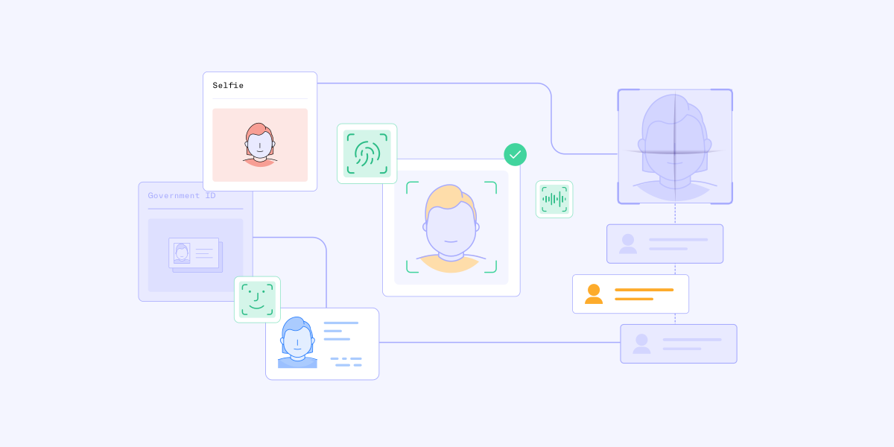
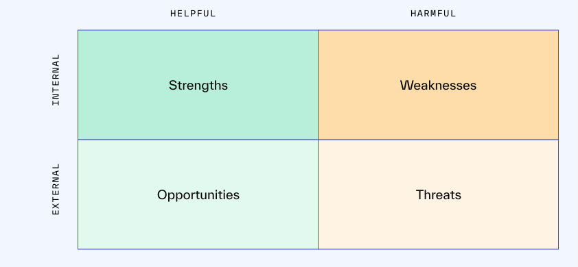
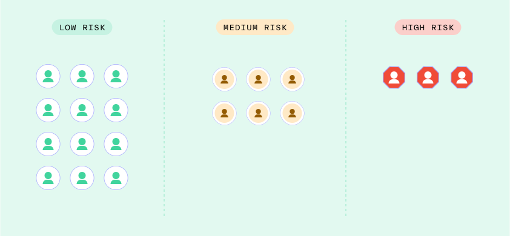
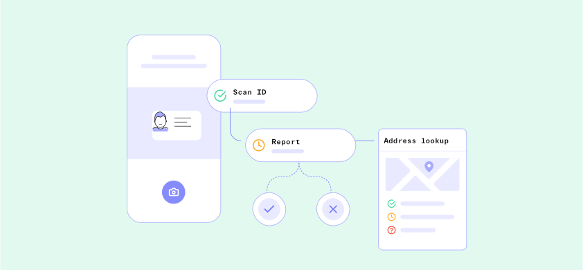

# How to evaluate and choose a fintech identity verification solution

Derivative asset title and general info 1

Lorem ipsum dolor sit amet, consectetur adipiscing elit, sed do eiusmod tempor incididunt ut labore et dolore magna aliqua. Ut enim ad minim veniam, quis nostrud exercitation ullamco laboris nisi ut aliquip ex ea commodo consequat.

Table of contents

[1\. Set goals and create a prioritized checklist of needs](./evaluate-fintech-identity-verification-solution.md#toc-1)[2\. Evaluate potential fintech IDV solutions](./evaluate-fintech-identity-verification-solution.md#toc-2)[3\. Select your vendor and plan your rollout strategy](./evaluate-fintech-identity-verification-solution.md#toc-3)[4\. Test everything — both during and after the rollout](./evaluate-fintech-identity-verification-solution.md#toc-4)[5\. Perform a post-launch audit and continuous monitoring](./evaluate-fintech-identity-verification-solution.md#toc-5)[Your fintech identity verification vendor should be your partner](./evaluate-fintech-identity-verification-solution.md#toc-6)

# How to evaluate and choose a fintech identity verification solution

As a company that is modernizing the financial system, you already know how important [identity verification](../blog/what-is-identity-verification-idv-and-how-does-it-work.md) is to your business and that you need a solution that empowers you to:

1.  Manage risk while complying with AML, KYC, KYB, and other regulations
2.  Control for the friction that identity verification can potentially introduce into your sign-up process, as friction might impact conversions — and thus your company’s growth
3.  Balance the first two priorities without putting undue strain on your overall operations

With this in mind, the thought of choosing an identity verification platform for your business — whether you are replacing an existing solution or selecting your organization’s first platform — can be intimidating. But don’t fret! We’re here to make this process less intimidating and walk you through the entire process of evaluating and ultimately implementing your IDV solution.

## Your step-by-step plan for choosing an IDV solution

Below, we’ve provided a detailed, step-by-step walkthrough of the key steps you should follow when selecting an IDV solution for your business.  

Want to jump to a specific step? Click on the section links below:

[1\. Set goals and create a prioritized checklist of needs](./evaluate-fintech-identity-verification-solution.md#toc-1)[2\. Evaluate potential fintech IDV solutions](./evaluate-fintech-identity-verification-solution.md#toc-2)[3\. Select your vendor and plan your rollout strategy](./evaluate-fintech-identity-verification-solution.md#toc-3)[4\. Test everything — both during and after the rollout](./evaluate-fintech-identity-verification-solution.md#toc-4)[5\. Perform a post-launch audit and continuous monitoring](./evaluate-fintech-identity-verification-solution.md#toc-5)[Your fintech identity verification vendor should be your partner](./evaluate-fintech-identity-verification-solution.md#toc-6)

### Download the guide most relevant for you

How to Switch Vendors

Download

Choosing a new vendor

Download

## 1\. Set goals and create a prioritized checklist of needs

### Setting your goals

Your goals should tie back to objectives and key results (OKRs) that you believe can be positively impacted by your choice of IDV solution. These should be concrete metrics that are important to your business, and you should ensure you’ll be able to accurately measure progress and change.

OKRs you might consider include:

-   Reduction in fraud rates
-   Increase in conversion rates
-   Decrease in manual review time
-   Decreased rate of false positives

A few notes on OKRs based on your company stage:

-   It’s important to consider whether you have existing data to compare results to or whether you’re gathering data and setting goals based on estimates. Earlier-stage fintech companies, for example, may not have a strong understanding of their fraud rates or [false positives](../identity-glossary/false-positive.md) rate. They may also be more focused on onboarding new customers than preventing fraud or minimizing false positives. If you fall into this boat, rather than using these OKRs to evaluate your eventual vendor choice, you may want to consider these metrics numbers to simply monitor and begin to understand — and then set goals against them in the future.
-   Fintech companies have a unique set of challenges in that minimizing fraud while maximizing conversion is almost always the ideal end state, but the balance between the two can ebb and flow as the company grows and changes. For example, if your company is targeted by fraud attacks for six months, conversion may begin to matter less as you fight the bad actors. When said fraud attacks subside, you may push again for conversion to make up for numbers lost during the attack.

#### Creating your checklist

As a next step, we recommend creating a detailed checklist for evaluating your vendor options. This checklist should prioritize features you need and want from your vendor based on your OKRs.

Creating your checklist

As a next step, we recommend creating a detailed checklist that you will use to evaluate your vendor options. As an end result, this checklist should help you prioritize your considerations during your vendor selection based on your OKRs.

Download example checklist

### Product features and vendor characteristics

Before you begin prioritizing your checklist to evaluate IDV solutions, it’s important to have a clear sense of the functionality and capabilities you need the platform to supply based on your OKRs.

Questions to ask yourself

Start by asking

What specific role does the IDV solution need to play in your organization?  
  
Do you intend for it to be used to facilitate one, multiple, or all of the following processes below?

Idv Processes

-   [Anti-Money Laundering (AML)](../blog/what-is-anti-money-laundering-aml-and-why-is-it-important.md)
-   [Know Your Customer (KYC)](../blog/know-your-customer-kyc.md)
-   [Customer Identification Program (CIP)](../blog/what-is-a-customer-identification-program-cip.md)
-   [Customer Due Diligence (CDD)](../identity-glossary/customer-due-diligence-cdd.md)
-   [Enhanced Due Diligence (EDD)](../blog/cdd-vs-edd-whats-the-difference.md)
-   [Continuous monitoring](../blog/perpetual-kyc-ongoing-customer-due-diligence.md)
-   [Know Your Business (KYB)](../blog/how-to-build-a-know-your-business-kyb-process.md)
-   Transaction monitoring
-   [Suspicious Activity Reports (SARs)](../blog/what-are-suspicious-activity-reports-sars.md)

Then ask yourself

What functionality does the solution need in order to play this role?  
  
When you picture the ideal IDV solution for your business, what functionality and capabilities does it offer?  
  
What specific verification methods does it need to support?

Verification options

-   Government ID verification
-   [Know Your Customer (KYC)](../blog/know-your-customer-kyc.md)
-   [Document verification](../blog/document-verification-understanding-the-whole-process.md)
-   [Database verification](../blog/what-are-issuing-database-verifications.md)
-   [Selfie verification](../blog/what-is-selfie-identity-verification-and-how-does-it-work.md)
-   [Mobile driver’s license verification](../blog/mobile-drivers-licenses-mdls-and-your-business.md)
-   [NFC / ePassport verification](../blog/nfc-e-passport-verification-guide.md)
-   [Employment / income verification](../blog/understanding-customer-source-of-funds-sof-and-source-of-wealth-sow.md)

There are different types of verifications that can be included in an onboarding process. When selecting a vendor, you want to be sure you have the ability to pick and choose which verification types work for your business, as some verification types can introduce more friction and others may be more specific for certain populations

Likewise

Are you looking for a tool that will only support identity verification, or are you looking for a platform that can perform additional capabilities and be an end-to-end solution?  
  
What features would an ideal solution offer other than verification?

-   [Reverification](../blog/what-is-reverification-and-why-does-it-matter.md)
-   [Multi-factor authentication](../blog/two-factor-authentication-statistics.md)
-   [Supplementary reports](../product/reports.md)
-   [Manual review](../product/cases.md)
-   [Fraud detection](../product/graph.md)

Additional considerations when choosing a partner for IDV:

-   What level of [automation](../product/workflows.md) do you expect from the IDV solution?
-   How flexible would your ideal solution be in terms of allowing you to [segment users based on risk](../blog/top-challenges-identity-verification.md), fine-tune [match requirements](../blog/how-match-requirements-allow-you-to-fine-tune-your-idv-processes.md), etc.?
-   How important is ease-of-use — both for your employees as well as your customers?
-   How will you evaluate a solution’s [privacy and security processes](../security.md)? What privacy laws and regulations does your business need to comply with? What certifications would be ideal for the IDV solution to have?
-   Do you need social proof to make a final decision? If so, customer reviews, testimonials, and case studies can all help you evaluate the IDV solutions you are considering.

It’s also important to consider how you will evaluate the vendor specifically. Here are a few questions you can ask to help gauge each vendor:

-   Do they have [expertise working with fintech companies](../industry/fintech.md) and financial organizations?
-   Do they have experience working with companies at the stage of development you’re in — whether you are a startup, scale-up, or established organization?
-   Do they show respect for your time, needs, and preferences in their communication with you?
-   Do they prioritize relationship management over “selling” their solution?
-   Will they offer ongoing support post implementation?
-   Have they demonstrated a track record of continuously adapting their product to meet evolving laws, regulations, and fraud techniques?
-   Will they partner with your organization to help move broader business initiatives forward?

Considerations for a replace

If you are replacing an existing IDV solution, a great way of determining which vendor will drive the most value for your business is to perform a SWOT analysis on your existing solution.  

Strengths

-   What does your existing IDV solution do well?
-   What features or functions does your current IDV solution offer that any replacement solution would also _need_ to offer in order for you to consider it?

Weaknesses

-   What does your existing IDV solution do poorly?
-   What weaknesses does your existing IDV solution have that a replacement would ideally address?

Opportunities

-   How might switching to a new IDV solution allow you to provide additional value to your users, delighting them and fostering affinity for your brand?
-   What business opportunities might become available by switching from your current IDV solution to a new one?
-   If you could dream up your ideal IDV solution, what features or functionality would it offer?

Threats

-   What potential threats (legal, regulatory, monetary, or otherwise) is your business exposed to due to its reliance on your existing IDV solution?
-   How might a new IDV solution help you address these threats?

As you think about the preferred features and functionality of your new solution, it can be helpful to approach the question through the lens of different business stakeholders — your users, investors, regulators, and internal fraud, risk, and product teams. Does the ideal onboarding process vary from stakeholder to stakeholder? What about metrics, and how different teams measure them? For example, your compliance and product teams might work together to own the onboarding process of your end users, and the metrics they measure might focus more on conversion and number of users.  

Your fraud team may be involved in the onboarding process as a peripheral stakeholder but not a key owner. However, understanding the priorities of your fraud team and learning how the onboarding process can have a downstream impact on what they monitor will help ensure that the IDV solution you ultimately select ends up driving as high a business value as possible.  

Considerations for new vendor selection

If you don’t currently have an IDV solution, you won’t be able to perform a SWOT analysis on an existing platform. But that doesn’t mean you have to go into this process blind.  

If you have team members who have used an IDV solution at other organizations, ask them to weigh in on must-have features and functionality. What did they value about past solutions? What did they dislike? What did they find themselves wishing they could do? Where did they find themselves wasting the most time or working around a problem because the software didn’t provide a solution?  

Remember: your discussions will likely involve individuals from multiple internal teams (for example, your fraud team and product team). Each team will have its own goals, which may occasionally conflict with the goals of other teams. You will need to balance these conflicting goals as you evaluate your IDV options and prioritize them — the checklist will help you do this.  

Creating your checklist

As a next step, we recommend creating a detailed checklist that you will use to evaluate your vendor options. As an end result, this checklist should help you prioritize your considerations during your vendor selection based on your OKRs.

Download example checklist

Additionally, check out the sections in this guide that relate to ripping and replacing an existing IDV vendor, and consider whether the vendor you select can partner and grow with you as your business reaches new phases and stages. Build for growth and longevity, rather than to solve a single pain point, and you’ll be set up to achieve both today’s OKRs and future OKRs.  

### Budget considerations

When ensuring an IDV solution falls into your budget, be sure to ask about:

Implementation and integration costs

While not all vendors charge a fee for implementation and integration, some will.

Cost per seat

Does the vendor charge a blanket fee regardless of how many users interact with the software, or will you be charged on a per-seat basis?

Cost per verification

Does the vendor charge you based on the number of verifications you perform? If so, do they charge based on attempted or completed verifications?

#### Downstream fraud considerations

Thinking through the downstream impact of your vendor selection can help ensure you select a vendor that will drive the highest value for your company both today and in the future.

Preventing fraud proactively saves money, however, the value of preventing fraud can be hard to prove; your business would have had to experience a fraud attack where you incurred losses to prove the value. Investing resources in fraud prevention upfront can insure your business against future fraud attacks that can damage both your revenue and brand. Fraud tools are like insurance plans — you invest in them upfront to ensure costly events are prevented.

Questions to consider:

-   Was money directly involved in the fraud attack(s)? In other words, did someone withdraw money from an account that wasn’t theirs? Or were credit card accounts opened by the same individual and drawn down, resulting in direct losses to your business? If the answer is yes, what was the cost of the fraud attack(s)?
-   Did your team need to drop the work they were doing to prevent and block the fraud attack — and stronghold the platform against future fraud attacks? If so, how much time and resources did this change of plans cost? What work was dropped, and how much did that loss of work cost your business?
-   Was your brand tarnished in any way? Did your users or potential users lose trust in your organization due to this fraud attack?

### Timeline

Be sure to consider factors that may impact, delay, or otherwise conflict with your integration schedule.  
  
Examples include:

Seasonality

Does your business historically see or anticipate a “busy season” at any particular time of year? If so, it’s likely a good idea to plan around this known increase in demand and schedule the final integration for a time that is less busy. 

Vendor capabilities

How long does it take to get up and running with the vendor?

Marketing calendar

Avoid changing systems right before big marketing promotions, as these campaigns can often lead to promotion abuse, and you want to ensure a system is in place to prevent that abuse. If your marketing team is launching a new campaign that is expected to drive a significant increase in new accounts, align the timeline of your vendor replacement accordingly. Either be sure that the IDV solution you select is fully implemented and troubleshooted so that it can handle the demand, or hold off until after the campaign.

Approval process

Multiple teams and approvers often cause delays in project schedules. Who needs to be involved in the decision-making, and at what point in the process do they need to be informed or involved?

## 2\. Evaluate potential fintech IDV solutions

Start broad, and narrow your list down

Start by conducting initial research with the goal of compiling a list of vendors who fit your requirements at a high level. If you’re not sure where to begin, think about companies that have seamless onboarding processes, and investigate who they partner with to perform IDV. Vendor websites, product pages, pricing pages, and reviews on third-party websites can all be helpful resources in this initial stage.  

Make your search more manageable by keeping your list to four or five vendors at this stage, as this number will make it easier to compare your options without being overwhelmed. Your goals and prioritized checklist should help narrow down your options.  

Next, schedule vendor demos. This will offer you insight into each platform’s user interface and give you the opportunity to ask questions you may not have been able to answer during your research. It will also allow you to better understand the capabilities and limitations of each vendor while getting a sense of what it will be like to work with each vendor.  

Following the demos, remove vendors with product gaps or performance issues. Then, return to your prioritized checklist and filter through your must-haves vs. nice-to-haves. You should aim to have two final contenders before moving to the next step.  

Perform a proof of concept with both vendors

Once you have narrowed down your list to two final contenders, the last step is to conduct a proof of concept (POC) — sometimes called a bake-off — with each of your selections in parallel. Running a POC is important because many vendors design their demos to look perfect. POCs will allow you to prove out capabilities and understand which vendors will actually help your business achieve its goals based on real business data.  

While there is no one right way to design and run a proof of concept that will apply to all organizations or in all situations, here are a few best practices:

-   Be sure to include input from your fraud and compliance teams as you design the test. Because these individuals will be working with the tool on a daily basis, they'll likely have unique insights you may not have considered otherwise.
-   Include your existing IDV solution (if you have one) in the test as well. This will give you the opportunity to directly test how your current platform performs against your potential replacement — and help you justify a transition.
-   Test each solution using the same dataset. This standardization will save you time and effort as you evaluate the performance of each tool. For example, you might compile a list of 200 IDs, alongside an answer key of which IDs should pass and which IDs should fail (as well as why they should fail), and use this list to test each solution.

When looking into a proof of concept, account for variables that might skew the results of the test.  

Variable examples

Context

What types of verification  
will you be testing?

Ideally, you’ll pit the two vendors head to head using the same verifications. You’d receive dramatically different results if one vendor were testing database verifications while the other vendor was testing government ID verifications.  
  
Testing which verification to use could also be valuable, but not during the proof of concept between vendors. Keep your variables to a minimum.

Do both vendors approach  
these verifications in the same way?

Certain types of verification can be approached very differently from vendor to vendor.  
  
For example, some vendors may require a barcode scan of the back of the ID, in addition to a photo upload of the front of the ID when verifying a driver’s license, while other vendors may only require a photo upload of the front of the ID. These differences can impact conversion rates and accuracy during the test.

What types of devices are being  
used to complete the test?

Consider device type (desktop vs. mobile), brand (iOS vs. Android), and age of device. Different devices have different cameras, which may impact photo quality — and subsequently the results.

Evaluating the results  

Now that you’ve run a POC, you can use the same goals and prioritized checklist you used to select the vendors for the POC. Start by asking: how did each solution perform compared to the control group? Would the results drive meaningful business results and help achieve the OKRs and goals that you outlined in Step 1? Metrics to consider include:  

Precision

Refers to the number of relevant surfaced results. This can be calculated by taking the number of true positive results divided by the total number of failed results.

Recall

Refers to how accurate the surfaced results are.This can be calculated by taking the number of true positive results divided by the total number of positive results.

Pass rate

The total number of individuals who are able to successfully complete verification (regardless of whether the result was a true positive or a false positive).

False positive rate

The total number of individuals who successfully completed verification but should have been declined or blocked. This number can be determined by dividing the number of false positives by the number of false positives and true negatives combined.

Number of cases pushed to manual review

How many cases required human involvement?

Accuracy of cases pushed to manual review

Should these cases have gone to manual review?

Speed of verification

How quickly were end users able to receive a result of their verification?

Additionally, we recommend sharing the results with each vendor to give them the opportunity to defend their results. Ask them:

-   Would this have performed better with a full integration?
-   Are there configurations that could have been changed to catch certain bad actors?
-   Consider whether one vendor was better at certain things, like fraud prevention, than the other.
-   Is there room to use both vendors in your process, or are you hoping to use one vendor across the board?
-   What will help you drive the most value for your business?

## 3\. Select your vendor and plan your rollout strategy

After completing the proof of concept, it’s time to make a decision!  
  
Part of your selection process should be to consider what options your vendor has for rollout and how much support they provide. Does the vendor have a standardized rollout process that they’ve built and recommend based on their existing customers?

Considerations for a replace

If you have an IDV solution and are in the process of transitioning to a new solution, a gradual rollout will likely make the most sense for your organization. Because you have an existing client base, a key priority for your organization during the rollout will be to control risk and minimize the impact your existing customers feel due to this transition.  

We recommend starting by rolling out the new IDV solution to 5% of your user base. However, there is no standard or right way to manage a rollout, as it should be based on the needs of your unique business. After your initial rollout, monitor and compare the results against your existing solution as well as your benchmark OKRs, and make adjustments as necessary. When you feel confident in the solution, roll it out to the next 10% and repeat the process. Some organizations that have a global user base choose to roll out based on the geographies they cover. This could also be an option — testing in a geography that has a lower volume user base before rolling out the solution to the next geography.  

Once you’ve fully migrated all of your onboarding processes and other IDV-related processes over to the new solution, think through how to transfer your data from your old solution to your new one. Many fintech organizations use existing data to continuously monitor and reverify their users at different moments throughout the user’s lifecycle. You’ll want to ensure you start the process of transferring any data in your old vendor’s system over to your new vendor to ensure that you can leverage it in your decision-making processes.  

Considerations for new vendor selection

If you are selecting your organization’s first IDV solution, you’re probably either currently manually verifying users or haven’t yet begun to onboard customers. With this in mind, there is little risk or need for a slow rollout. In most cases, it will be perfectly fine to launch your IDV solution all at once and adjust your setup as you begin seeing results and getting feedback from customers. Keep in mind that you’ll still want to monitor against your OKRs to ensure a successful rollout.  

## 4\. Test everything — both during and after the rollout

Testing verification functionality

All identity [verification methods](../blog/what-is-identity-verification-idv-and-how-does-it-work.md) do not work the same, and specific functionality can vary significantly from platform to platform. It’s important to test every verification you plan to incorporate into your verification flow. Some vendors, like Persona, also have a highly customizable feature set that different industries leverage in different ways. Ensure your verification selection — and how those verifications function — are aligned with fintech specifications.

Here’s how to test specific verification types:

Government ID verification

What types of government-issued ID do you plan on accepting for verification? Driver’s licenses? Passports? State-issued photo IDs? [Mobile driver’s licenses (mDLs)](../blog/mobile-drivers-licenses-mdls-and-your-business.md) and [ePassports](../blog/nfc-e-passport-verification-guide.md)? Given there are thousands of different government-issued IDs, it’s ok that you won’t be able to test everything. You should know the limitations of your testing and monitor the real-time data that comes in from your users as it relates to the gaps in your testing.

[Document verification](../blog/document-verification-understanding-the-whole-process.md)

If you intend to accept other forms of documentation for verification purposes, you should specifically test the upload and verification process for each type of document you will accept.  
  
Likewise, it’s important to define what “verification” actually means for the document in question. Is it simply a check to ensure that something was uploaded — i.e. more of a collection purpose? Is there certain information that must be extracted from the document? Are there particular fields in the document that need to be compared against existing information you have about your user? For example, say the user inputs their name and address during onboarding and your business wants to validate that user’s address by collecting a proof of address.  
  
One way to solve this would be to have an individual manually compare the information on the document to the information the user inputted. But a faster and more efficient way would be to use an IDV vendor to compare the information and consider it verified (or not) based on whether it matched.

Database verification

Will your verification process include [database checks](../blog/what-are-issuing-database-verifications.md) — for example, [AAMVA](../blog/enhance-identity-verification-decisions-aamva-checks.md), eCBSV, TIN, or Serpro checks? If so, test these integrations. How long does each query take? Are the results accurate? Understanding the limitations of database verifications across the countries you serve is also very important. One limitation of the U.S.’s database system is that there isn’t a single database that represents the full population of individuals — thin file and no file individuals might not be accounted for, and therefore could fail a certain database verification even if they’re good actors. Consider what types of verifications you might offer for individuals who cannot pass the database verification but may be users you do want on your platform.

Selfie verification

If you will be leveraging [selfie verification](../blog/what-is-selfie-identity-verification-and-how-does-it-work.md), be sure your test includes people of different ages, genders, and ethnicities. This will allow you to understand what, if any, [biases](../blog/reducing-ai-bias.md) may exist in the system so that you can correct for them. Likewise, it’s important to understand what liveness detection protocols the system has in place to identify [deepfakes](../blog/what-are-deepfakes.md) and other spoofs.

Progressive risk segmentation

If your IDV solution allows for [progressive risk segmentation](../blog/top-challenges-identity-verification.md), it can be an excellent means of controlling friction in your verification process, as it allows you to tailor the verification experience for each user based on how risky you deem them to be. Instead of designing one verification flow that every user goes through, you will need to create different risk segments and design multiple flows, adding more friction for higher-risk users that can be triggered in real time.

It’s worth noting this type of segmentation requires existing data in order to be most successful and accurate. Organizations starting with their first IDV solution will want to either apply existing knowledge from similar companies and refine them over time or wait to apply progressive risk segmentation until they’ve learned what their risk population actually looks like. Each organization has unique data and unique types of fraud — the challenge is curating an IDV system that is uniquely fit to handle those different instances.

Implementing progressive risk segmentation can be a powerful way to strike the balance between conversion and fraud prevention. But it also introduces more moving pieces into your verification flow, and more moving pieces means more testing. This is not a bad thing, but rather something that needs to be accounted for.

Workflows, automation, and integrations

Many best-in-class IDV platforms include [workflows and other options](../product/workflows.md) designed to help automate some or all of your verification process. These options can help you scale your business while keeping fraud- and compliance-related labor costs under control — often while improving accuracy and reducing errors.

Questions to help guide your use of automation tools include:

-   As an organization, what is your approach to thinking about automation more holistically? Do you want to move toward automating everything or simply leverage automation to help your manual review team work more efficiently?
-   Can the automation support the business logic you need it to? For example, if individuals in particular countries need to be routed to manual review, can the system identify countries, tag the verification with the relevant country, and surface it to the manual review team to better support their process?
-   Do you have engineering resources to make technical changes? Or do you need a tool that allows non-technical teams to make changes?

In the past, it could be difficult for your various systems to speak to one another. This meant that data about individual users often existed in silos within your business, making it difficult for you to develop a comprehensive understanding of your customers and users.

Today, integrations can make it fairly easy for your IDV platform to [connect and communicate with your other systems](../solutions/persona-marketplace.md) — whether that be your CRM or other databases, customer support tools, communications tools, fraud detection solutions, and other solutions in your AML/KYC toolkit.

Seamless integrations between your tools make it easier for your fraud team to use all of your signals to flag, investigate, and take action against potential fraud without having to jump through additional hoops.

If you plan to use integrations to connect your IDV solution to other systems, it’s important to test these connections to ensure the systems play well with one another. Can your solution:

1.  Integrate with the platform seamlessly into all of your workflows, not just your onboarding flows?
2.  Compile all identity data into a single place (such as a dashboard) that will allow you to gain a more comprehensive understanding of your users?
3.  Update your systems of record and connect the verified identity back into your customer lifecycle?

End-user interface

As you test the end-user interface, bear in mind that different customers may access your application or service using different types of devices (desktop, mobile, tablet) and operating systems (Windows, iOS, Android). Because user experience can vary drastically across different devices and operating systems, it’s in your best interest to test UX across all of these options. Likewise, consider how your identity verification flow may read across different languages.

## 5\. Perform a post-launch audit and continuous monitoring

You’ve integrated your IDV solution, tested everything, and addressed any issues found during the rollout. Congratulations! You’ve just accomplished a tremendous feat. But resist the temptation to call it a day. Now, it’s critical to complete a post-implementation audit, which will allow you to measure whether or not the project has fulfilled the goals you initially set out to fulfill over time.  

When should you complete the audit? Ultimately, there is no right answer to the question. Some organizations will conduct an audit three months after the rollout is complete; others will choose six months or a year. If you’re unsure, here are some considerations:  

Ensure you have enough data

How much data do you need to make an informed determination about the success of the project? This will require a judgment call on your part. When in doubt, err on the side of collecting more data to ensure you’re making a decision based on a complete dataset.

Allow enough time for your team to get up to speed

As your employees first begin using the IDV platform, they are more likely to make mistakes. With this in mind, it’s important to allow your employees enough time to get up to speed on the new platform before you try to gauge the efficacy of the platform.

Account for any bugs in the system

Did the rollout uncover any unexpected issues or hiccups that needed to be addressed and corrected for? If so, your reporting period should begin after those issues have been addressed; otherwise, your results may appear more negative than they really are.

Once you have selected your reporting period, begin your audit by returning to your OKRs. Has the selected IDV platform helped you hit the OKRs you set out to achieve? Has it empowered you to reach your goals or address your challenges? Is there anything you had expected to accomplish that you have not? Conversely, have you enjoyed any benefits that you didn’t originally anticipate?  

If you find the implementation hasn’t lived up to your expectations in any way, you might consider:  

-   **Providing feedback to your vendor** and sharing your findings. A true partner will work with you to remedy the issues you’ve identified or share possible alternative solutions.
-   **Further refining your processes**, workflows, reports, etc. to see if it is possible to improve performance to where it needs to be.
-   **Exploring additional, complementary tools** — whether they are offered by the same vendor or a different vendor. This might help you fill any performance gaps.
-   **Reevaluating success metrics** to determine if they are the right way of measuring success.

Throughout the audit process, be sure to stay in communication with your vendor. They may be willing to play a role in the audit and/or may have resources to help you. Likewise, if issues or concerns are found during the audit, they’ll likely be willing to help you resolve those issues — both because they are experts in how their platform works and because it’s simply good business for them to want you to be satisfied with your results.  

Additionally, you’ll want to perform continuous monitoring of your solution over time. As we mentioned above, your priorities and goals may shift in such a way that requires changing certain settings in your solution or pivoting the way that it’s integrated.  

As an example:

When you were a smaller company, you may have wanted to prioritize conversion over everything to gain a larger user base and learn from the data. Now that you’ve learned from the data, you can start to prioritize removing bad actors from your platform and preventing them from onboarding in the first place. The provider you selected should have the flexibility and configurability to help support your business priorities as you grow and your goals change.

## Your fintech identity verification vendor should be your partner

The process of selecting and implementing an identity verification platform — whether it’s the first one for your business or a replacement for an existing solution — is a big decision. That said, with adequate planning and preparation, it’s possible to remove a lot of the unknown from the equation. You can also significantly improve the process by taking the time to select a vendor who you feel confident is acting with your best interests in mind — a vendor who will partner with you to achieve your OKRs and drive business value over time.

Here at Persona, we believe that your IDV provider shouldn’t just be another vendor. That’s why we view each organization we work with as a partner. Persona works deeply to understand not just your use case, but how your use case meaningfully ties into your business goals. In understanding the why and the context of your business challenges, we’re able to make recommendations and brainstorm solutions. This is also how we continue to innovate and drive value for all the businesses we partner with.

We also believe that in order to best serve our partners, we must have a deep understanding of the space that each partner operates within. As many of our partners operate within the financial space, this means we have a deep organizational understanding of the unique challenges, requirements, and regulations that apply to your business. The result is an all-in-one identity platform specifically designed to empower you to reach your goals.

Use our [Verifications solution](../product/verifications.md) to verify users according to your unique needs. Leverage [progressive risk segmentation](../product/dynamic-flow.md) to tailor the verification flow to each of your customers. [Automate](../product/workflows.md) processes to boost efficiencies as you scale. Screen customers against a [variety of reports](../product/reports.md) in order to gain a comprehensive view of their risk profile. Review and investigate suspicious cases in a single, [configurable hub](../product/cases.md). Leverage [link analysis](../product/graph.md) to proactively identify potential fraud rings in your database.
