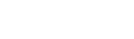
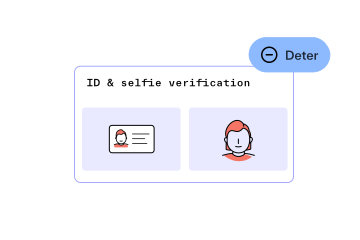
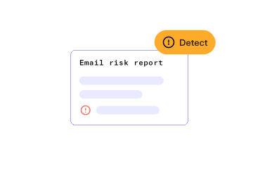
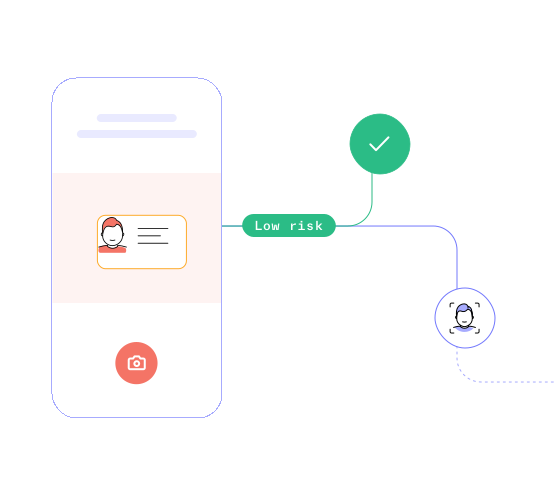
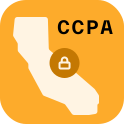
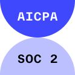
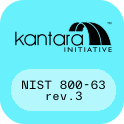

# Take a holistic approach to combating generative AI fraud

Build an end-to-end fraud mitigation strategy with Persona’s configurable identity platform.  

Leverage dozens of passive and active risk signals to identify fraud patterns and anomalies

Uncover and proactively block large-scale fraud with link analysis

Create verification flows that actively segment users based on their risk profile  

Trusted by startups & the world’s largest companies

## Safeguard your platform from GenAI fraud

Ensure that your users are who they say they are throughout their lifecycle.

### Deter potential fraudsters

Trigger any combination of verification methods based on how risky a user or transaction is.

### Detect risky behavior

Leverage passive signals (e.g. IP addresses and device fingerprints) as well as active signals (e.g. IDs and live selfies) to expose more fraudsters.

### Deny bad actors

Protect your front and back books with dynamic user risk segments that consolidate active, passive, and behavioral data to automatically block known fraudsters from reattempting applications or account openings.

## Deter fraud without hurting conversion

Convert good users faster by dynamically adjusting friction based on real-time risk signals during the collection flow.

## Expose hard-to-catch fraud rings quickly

Capture more fraud by uncovering the reach of fraud rings. Find linked accounts using Persona-collected or imported data, and alert your team via the dashboard, Slack, or email, so they can investigate complex attacks in real time.

RESULTS IN SECONDS NOT MINUTES

< 3 seconds to run complex Graph queries across millions of nodes

[

### nWay decreases chargebacks by 80% and proactively blocks linked accounts with Persona Graph & KYC solutions

Read the full story

](../customers/nway.md)

### Security and privacy at our core

Security and privacy are paramount to a trusted relationship. That’s why Persona is compliant and certified to the highest industry standards and committed to protecting you and your customers' privacy.

## Let’s talk 👋

Let us know how we can help and we’ll get in touch with you shortly.

Reach out to our team for a custom demo.

Business email address

Phone Number (optional)

InternationalAfghanistanÅland IslandsAlbaniaAlgeriaAmerican SamoaAndorraAngolaAnguillaAntigua and BarbudaArgentinaArmeniaArubaAscension IslandAustraliaAustriaAzerbaijanBahamasBahrainBangladeshBarbadosBelarusBelgiumBelizeBeninBermudaBhutanBoliviaBonaire, Sint Eustatius and SabaBosnia and HerzegovinaBotswanaBrazilBritish Indian Ocean TerritoryBrunei DarussalamBulgariaBurkina FasoBurundiCambodiaCameroonCanadaCape VerdeCayman IslandsCentral African RepublicChadChileChinaChristmas IslandCocos (Keeling) IslandsColombiaComorosCongoCongo, Democratic Republic of theCook IslandsCosta RicaCote d'IvoireCroatiaCubaCuraçaoCyprusCzech RepublicDenmarkDjiboutiDominicaDominican RepublicEcuadorEgyptEl SalvadorEquatorial GuineaEritreaEstoniaEthiopiaFalkland IslandsFaroe IslandsFederated States of MicronesiaFijiFinlandFranceFrench GuianaFrench PolynesiaGabonGambiaGeorgiaGermanyGhanaGibraltarGreeceGreenlandGrenadaGuadeloupeGuamGuatemalaGuernseyGuineaGuinea-BissauGuyanaHaitiHoly See (Vatican City State)HondurasHong KongHungaryIcelandIndiaIndonesiaIranIraqIrelandIsle of ManIsraelItalyJamaicaJapanJerseyJordanKazakhstanKenyaKiribatiKosovoKuwaitKyrgyzstanLaosLatviaLebanonLesothoLiberiaLibyaLiechtensteinLithuaniaLuxembourgMacaoMadagascarMalawiMalaysiaMaldivesMaliMaltaMarshall IslandsMartiniqueMauritaniaMauritiusMayotteMexicoMoldovaMonacoMongoliaMontenegroMontserratMoroccoMozambiqueMyanmarNamibiaNauruNepalNetherlandsNew CaledoniaNew ZealandNicaraguaNigerNigeriaNiueNorfolk IslandNorth KoreaNorth MacedoniaNorthern Mariana IslandsNorwayOmanPakistanPalauPalestinePanamaPapua New GuineaParaguayPeruPhilippinesPolandPortugalPuerto RicoQatarReunionRomaniaRussiaRwandaSaint BarthélemySaint HelenaSaint Kitts and NevisSaint LuciaSaint Martin (French Part)Saint Pierre and MiquelonSaint Vincent and the GrenadinesSamoaSan MarinoSao Tome and PrincipeSaudi ArabiaSenegalSerbiaSeychellesSierra LeoneSingaporeSint MaartenSlovakiaSloveniaSolomon IslandsSomaliaSouth AfricaSouth KoreaSouth SudanSpainSri LankaSudanSurinameSvalbard and Jan MayenSwazilandSwedenSwitzerlandSyriaTaiwanTajikistanTanzaniaThailandTimor-LesteTogoTokelauTongaTrinidad and TobagoTristan da CunhaTunisiaTurkeyTurkmenistanTurks and Caicos IslandsTuvaluUgandaUkraineUnited Arab EmiratesUnited KingdomUnited StatesUruguayUzbekistanVanuatuVenezuelaVietnamVirgin Islands, BritishVirgin Islands, U.S.Wallis and FutunaWestern SaharaYemenZambiaZimbabwe

Anything else?

Get demo

By submitting this form, you agree to receive communications at the email address and phone number you provided. See our [Privacy Policy](../legal/privacy-policy.md) for more information about our privacy practices.

Trusted by startups and the world’s largest companies

