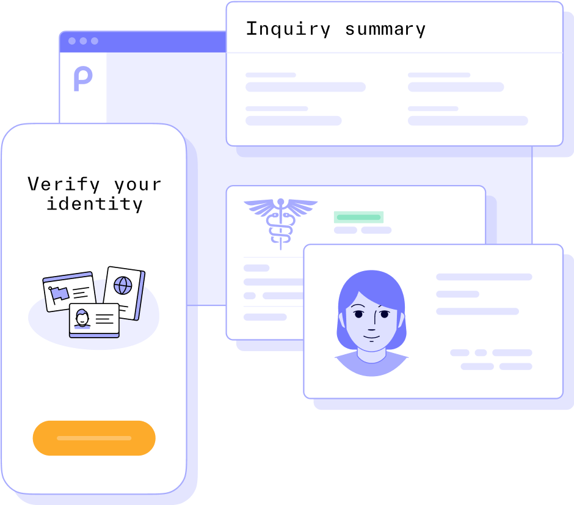
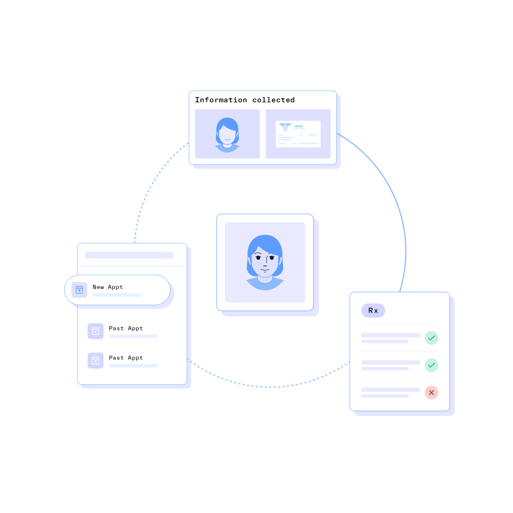
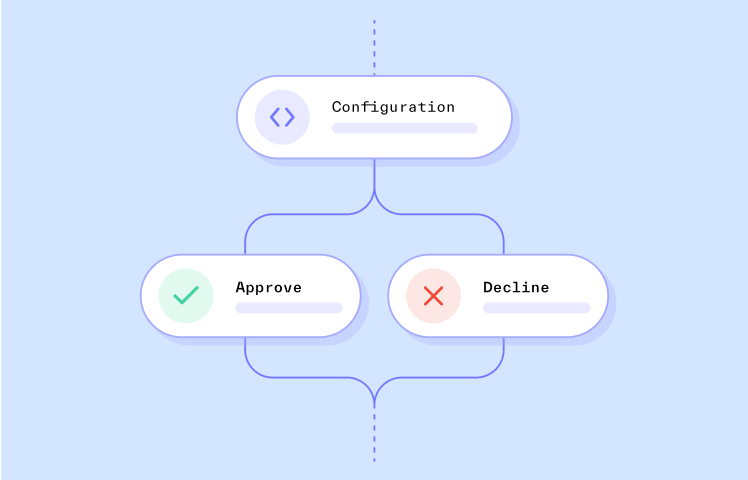
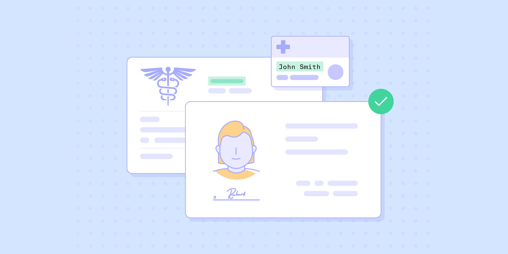

# Seamless patient verification without the headache

Expedite onboarding, decrease patient frustration, safeguard PII, and orchestrate HIPAA-compliant identity verification for your healthcare platform. BAA offered upon request.

Trusted by leading digital healthcare companies

.svg)

.svg)

## Verify patients quickly and securely

Provide your patients with the same quality of care whether in-person or online, starting at onboarding.

Reduce patient drop-off

Automate onboarding to quickly and securely verify patients online, as part of your intake process. Prevent patient frustration with user-friendly flows and customizable in-app guidance.

Protect patient PII

Stay HIPAA compliant and collect only the patient data you need by setting redaction and access policies. To protect your sensitive data, Persona offers a BAA upon request.

Adhere to statewide or regional requirements

Tailor your collection flow by region. Choose what information to collect, which documents to accept, and which region-specific guidelines to include.

Automate administrative tasks

Streamline patient enrollment operations by consolidating identity data, screening documents, sending emails, and updating your admin tool directly from Persona.

## Verify patients at any point in their user journey.

Trigger patient verification during vital moments, such as prior to accessing sensitive records, ahead of an appointment, or before sending a prescription.

## How Persona verifies patients

### Collect

Make it easier for patients to get verified. Seamlessly collect patient data and health insurance information at any point in their user life cycle. Configure the exact PII to collect and dynamically adjust friction for flows.

### Verify

Authenticate patient identities with any verification method (e.g. government ID, database). Confirm health documents like insurance cards to ensure patients have the coverage they need.  

### Automate

Expedite onboarding to patient portals by automatically approving or declining a patient based on configured rules. Create custom workflows to automate manual tasks.  

### Designed with compliance in mind

Persona is committed to protecting your patients’ privacy, which is why we offer BAAs. Get in touch with our team to learn more.

[

Learn more

](../security.md)

[

### K Health uses Persona to seamlessly integrate with healthcare systems and streamline patient verification

Read the full story

](../customers/k-health.md)

## More resources

Lorem ipsum dolor it amet respequiv aloo mateer.

[

Know Your Patient (KYP): How to mitigate healthcare fraud

9 mins

Read more

](https://withpersona.com/blog/know-your-patient-kyp-how-to-mitigate-healthcare-fraud)

[

Identity management in digital health: protecting patient identities

8 mins

Read more

](https://withpersona.com/blog/identity-management-in-digital-health-protecting-patient-identities)

No items found.
