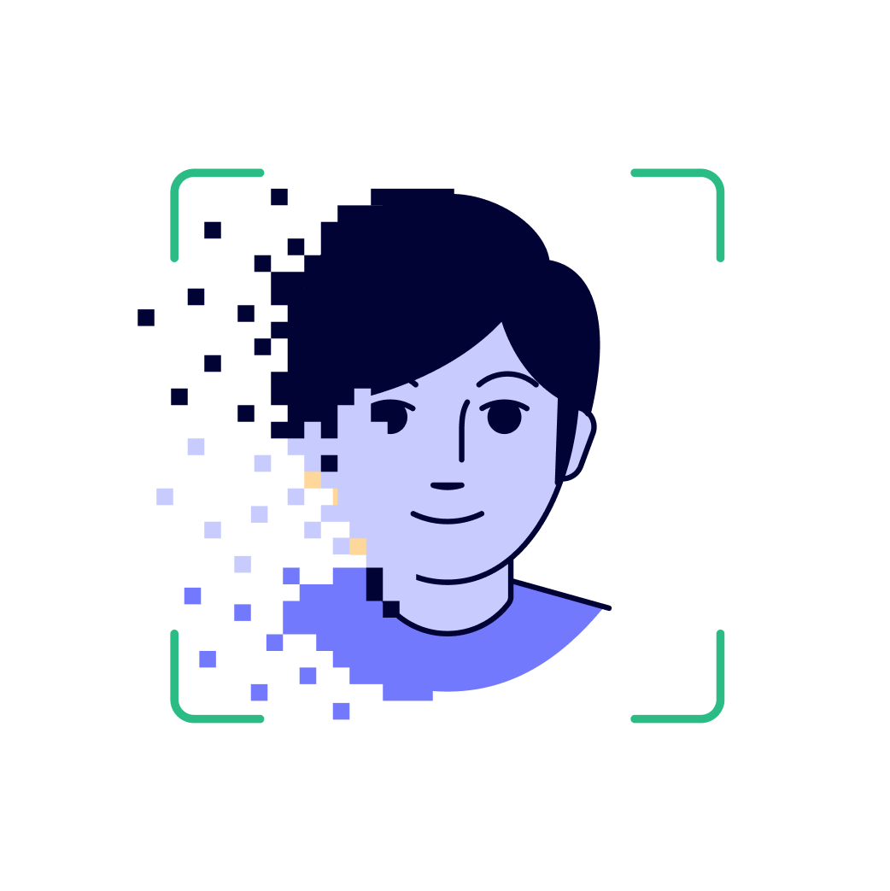
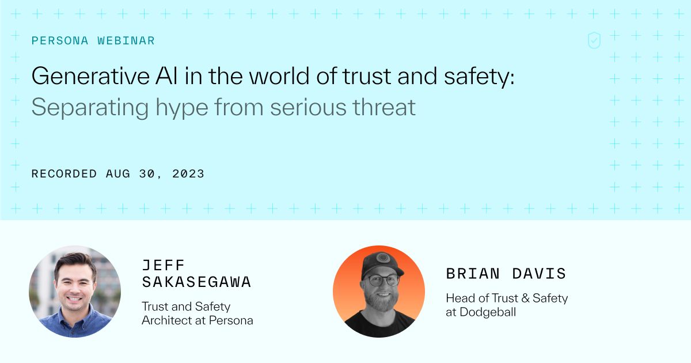
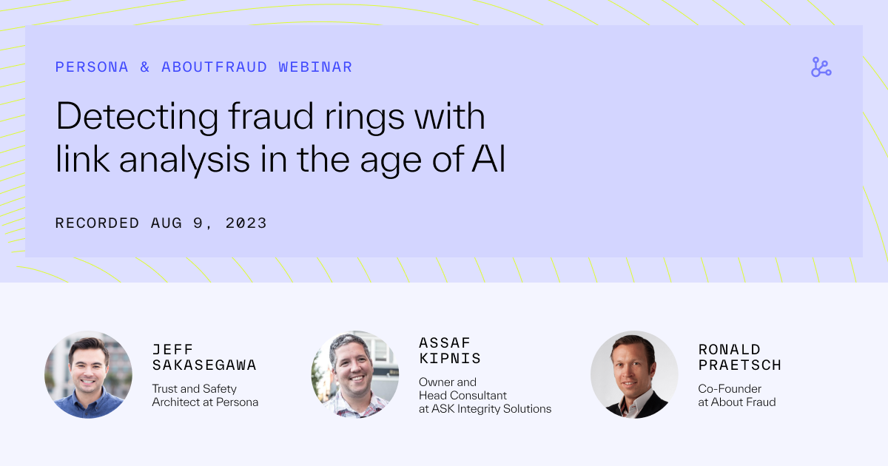
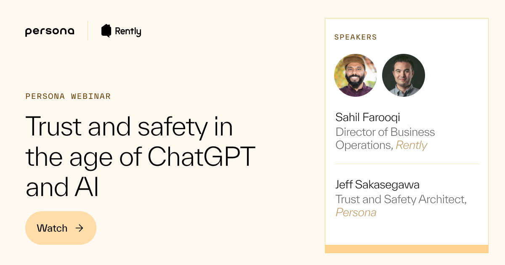

# How to take a holistic approach to combating generative AI fraud

Building an end-to-end fraud strategy ensures a robust defense against GenAI fraud and future threats.

[

Get the guide

](./reduce-generative-ai-fraud.md#get-the-guide)

## The 4 pillars of a holistic fraud strategy

Leverage a comprehensive suite of signals and evidence

Collect a wide array of data points and evidence such as user behavior analytics, device identification, identity proofing evidence, and verification data to develop a nuanced understanding of a user's risk profile.

Surface more insights by combining data

No single provider or model can handle all fraud vectors. Use each risk signal collected in order to create an ensemble model - a combination of different models, signals, and algorithms - to detect and pinpoint what’s risky from the data collected.

Analyze your data at the population-level to find connections between bad actors

Examine your data as a whole in order to identify trends, repeat patterns, and anomalies in user behavior that would be indicative of a potential fraud threat and block them immediately.

Use an identity platform that supports active segmentation to make better-informed decisions in real time

By fully leveraging the collected signals and evidence, ensemble models, and population-level insights, you can actively segment users based on their risk level. You can surface the right approach at the right time.

## The strategic guide to fighting GenAI fraud

Learn what you can implement now to actively defend your business against GenAI-powered fraud while respecting legitimate users and preventing economic losses.

\*

Email address

\*

First name

\*

Last name

\*

Company

Submit

Thank you, we’ll email you soon.

## More resources

Lorem ipsum dolor it amet respequiv aloo mateer.

[

Generative AI in the world of trust and safety: Separating hype from serious threat

8/30/2023

Download

](https://withpersona.com/events/generative-ai-trust-safety)

[

Detecting fraud rings with link analysis in the age of AI

8/9/2023

Download

](https://withpersona.com/events/detecting-fraud-rings-with-link-analysis-in-the-age-of-ai)

[

Trust & Safety in the Age of ChatGPT and AI

7/19/2023

Download

](https://withpersona.com/events/trust-safety-in-the-age-of-chatgpt-and-ai)
