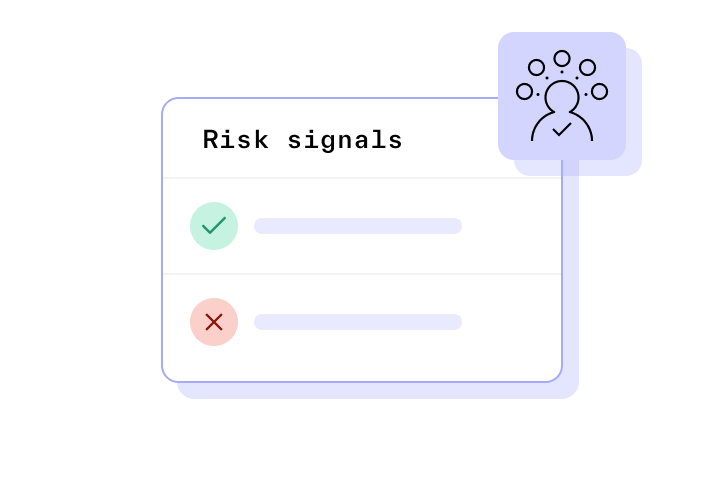
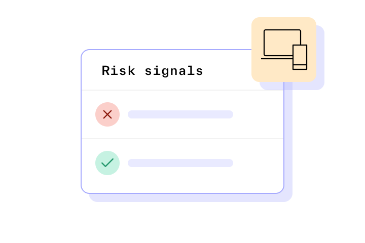
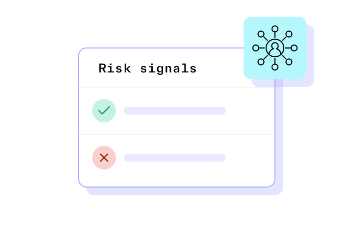
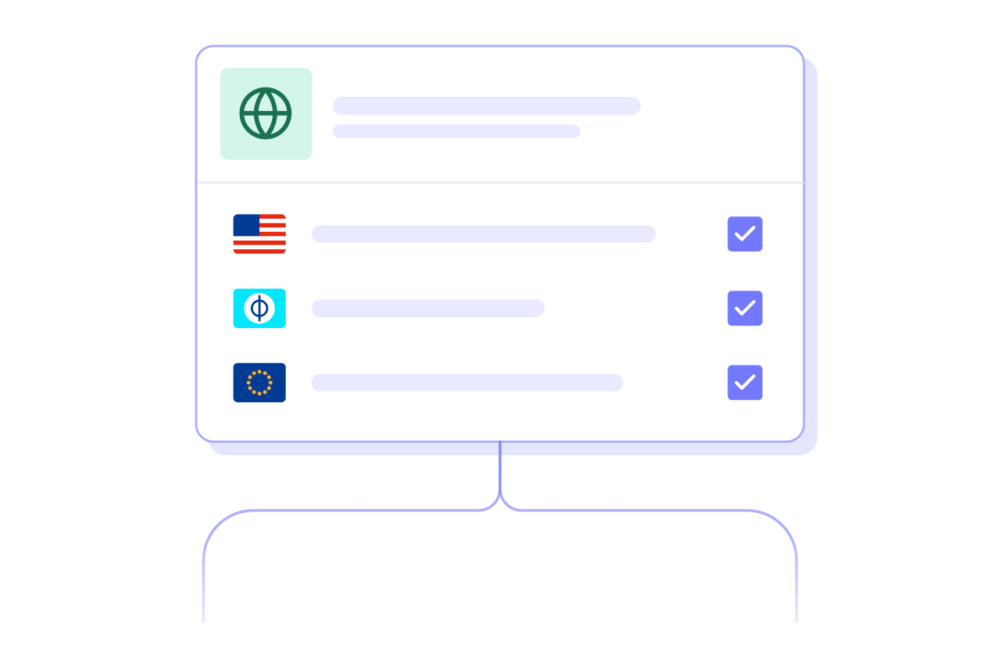
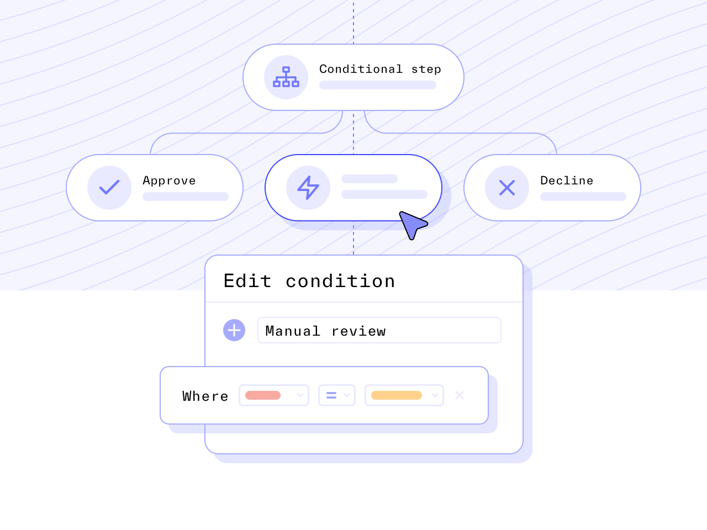

# Enrich users’ profiles with trusted data sources

Enrich and supplement your understanding of an entity with reports such as Watchlist, PEP, Address Lookup, Adverse Media, and more with Persona’s full-suite identity platform.

Screen through all your matches in one place

Streamline your operations with automated decisioning based on report hits  

Customize your match configurations across reports like Adverse Media to control your match rate while staying compliant

Trusted by startups & the world’s largest companies

## Enrich your customer data with any type of Report, under one roof

Help your operations team be more efficient by customizing match requirements and automating decisioning

Watchlists

Screen across 100+ global sanction and warning lists, and 5000+ PEP lists.

Adverse media

Automate negative news checks across 400+ million articles.

Profile report

Expose an individual’s full identity record to meet regulatory compliance.

Phone and email risk

Understand the reputation of a phone number or email address.

Address lookup

Enrich information about a U.S. address.

Social media lookup

Enrich a user’s profile with their social media handles.

## Automatically collect a variety of passive signals

### Behavioral signals

Collect behavioral data as users go through your collection flow to help you understand their potential risk — without tapping data science resources.

### Network and device signals

Use passively collected network and device signals to gauge potential fraud risks and act on them.

### Linked accounts signals

Stop fraud before it happens. Proactively block fraudsters after detecting similar data signals and matching them back to known bad actors so they can’t access and harm your platform.

## Choose the lists to screen users against

**Global sanctions, warning, and probability lists**  
Choose from 100+ lists to screen against to fulfill your organization’s unique compliance requirements.

  
‍  
**Politically Exposed Persons (PEP) lists**
  
Choose from 5000+ lists and customize your match configurations, including which PEP categories to classify and flag.

Make better decisions, faster

Define and understand how user identity is processed. Customize decision flows to fit your processes, streamline operations with flexible rule sets and repeatable actions, and surface priority cases for further investigation or followup.

There was no competition when it came to Persona’s breadth of services — no one else offered everything.

Jess T.

Product lead at AngelList

### Security and privacy at our core

Security and privacy are paramount to a trusted relationship. That’s why Persona is compliant and certified to the highest industry standards and committed to protecting you and your customers' privacy.

## Let’s talk 👋

Let us know how we can help and we’ll get in touch with you shortly.

Reach out to our team for a custom demo.

Business email address

Phone Number (optional)

InternationalAfghanistanÅland IslandsAlbaniaAlgeriaAmerican SamoaAndorraAngolaAnguillaAntigua and BarbudaArgentinaArmeniaArubaAscension IslandAustraliaAustriaAzerbaijanBahamasBahrainBangladeshBarbadosBelarusBelgiumBelizeBeninBermudaBhutanBoliviaBonaire, Sint Eustatius and SabaBosnia and HerzegovinaBotswanaBrazilBritish Indian Ocean TerritoryBrunei DarussalamBulgariaBurkina FasoBurundiCambodiaCameroonCanadaCape VerdeCayman IslandsCentral African RepublicChadChileChinaChristmas IslandCocos (Keeling) IslandsColombiaComorosCongoCongo, Democratic Republic of theCook IslandsCosta RicaCote d'IvoireCroatiaCubaCuraçaoCyprusCzech RepublicDenmarkDjiboutiDominicaDominican RepublicEcuadorEgyptEl SalvadorEquatorial GuineaEritreaEstoniaEthiopiaFalkland IslandsFaroe IslandsFederated States of MicronesiaFijiFinlandFranceFrench GuianaFrench PolynesiaGabonGambiaGeorgiaGermanyGhanaGibraltarGreeceGreenlandGrenadaGuadeloupeGuamGuatemalaGuernseyGuineaGuinea-BissauGuyanaHaitiHoly See (Vatican City State)HondurasHong KongHungaryIcelandIndiaIndonesiaIranIraqIrelandIsle of ManIsraelItalyJamaicaJapanJerseyJordanKazakhstanKenyaKiribatiKosovoKuwaitKyrgyzstanLaosLatviaLebanonLesothoLiberiaLibyaLiechtensteinLithuaniaLuxembourgMacaoMadagascarMalawiMalaysiaMaldivesMaliMaltaMarshall IslandsMartiniqueMauritaniaMauritiusMayotteMexicoMoldovaMonacoMongoliaMontenegroMontserratMoroccoMozambiqueMyanmarNamibiaNauruNepalNetherlandsNew CaledoniaNew ZealandNicaraguaNigerNigeriaNiueNorfolk IslandNorth KoreaNorth MacedoniaNorthern Mariana IslandsNorwayOmanPakistanPalauPalestinePanamaPapua New GuineaParaguayPeruPhilippinesPolandPortugalPuerto RicoQatarReunionRomaniaRussiaRwandaSaint BarthélemySaint HelenaSaint Kitts and NevisSaint LuciaSaint Martin (French Part)Saint Pierre and MiquelonSaint Vincent and the GrenadinesSamoaSan MarinoSao Tome and PrincipeSaudi ArabiaSenegalSerbiaSeychellesSierra LeoneSingaporeSint MaartenSlovakiaSloveniaSolomon IslandsSomaliaSouth AfricaSouth KoreaSouth SudanSpainSri LankaSudanSurinameSvalbard and Jan MayenSwazilandSwedenSwitzerlandSyriaTaiwanTajikistanTanzaniaThailandTimor-LesteTogoTokelauTongaTrinidad and TobagoTristan da CunhaTunisiaTurkeyTurkmenistanTurks and Caicos IslandsTuvaluUgandaUkraineUnited Arab EmiratesUnited KingdomUnited StatesUruguayUzbekistanVanuatuVenezuelaVietnamVirgin Islands, BritishVirgin Islands, U.S.Wallis and FutunaWestern SaharaYemenZambiaZimbabwe

Anything else?

Get demo

By submitting this form, you agree to receive communications at the email address and phone number you provided. See our [Privacy Policy](../legal/privacy-policy.md) for more information about our privacy practices.

Trusted by startups and the world’s largest companies

