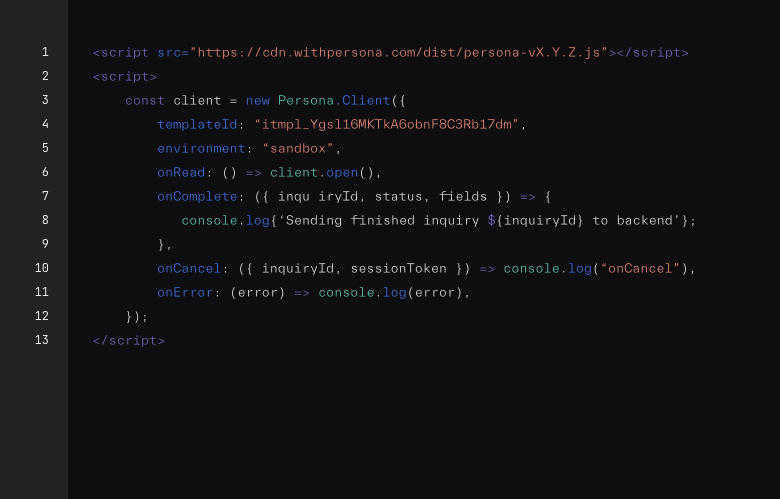
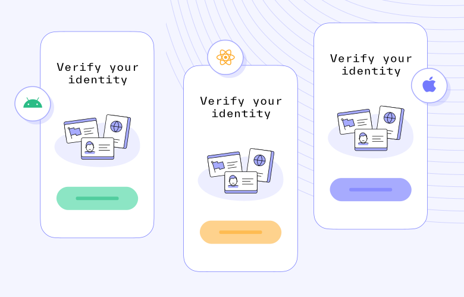
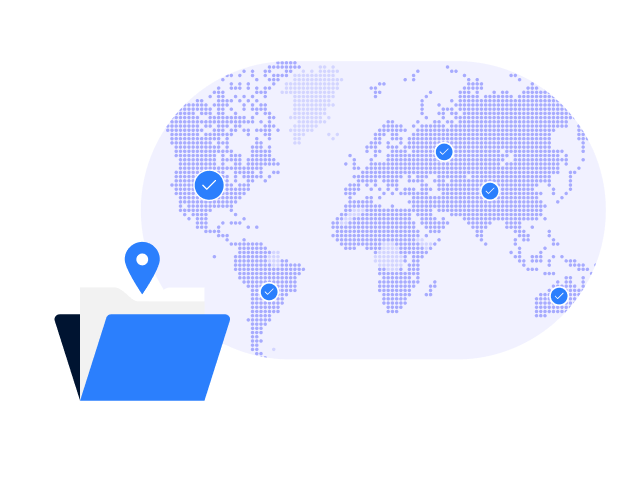

# Identity infrastructure to verify Uber users globally

Expedite onboarding, mitigate fraud, and orchestrate identity verification across your mobility, freight, and food delivery businesses.

[

Try it today

](https://app.withpersona.com/dashboard/register)

TRUSTED BY THE WORLD'S MOST INNOVATIVE COMPANIES

.svg)

.svg)

## Tailored to support every identity use case across Uber’s business

Mobility

Automatically verify and onboard most riders and drivers in seconds, and reduce user drop-off with live guidance. Step friction up or down dynamically based on live risk signals.

Food Delivery

Convert more users and delivery drivers with a seamless onboarding experience, and send any edge cases to your team for manual review or additional follow-up.

Freight

Consolidate and automate the onboarding process for shippers and carriers with our integrated KYB-KYC solution.

Trust and Safety

Uber is built on trust, and trust can’t exist without safety. Trigger safety mechanisms like reverifications and list screenings during the customer journey to prevent account takeovers or risky users from harming your platform.

## Verify Uber users with an expansive library of verifications

Verify users with any combination of Persona’s verifications and reports, all available via one integration.

We’ve created sample verification screens to help Uber understand what a partnership with Persona could look like.

Government ID

Verify IDs across 200+ countries and regions.

Mobile Driver’s License

Verify mobile driver’s (mDLs) securely from digital wallets.

NFC

Automatically and securely verify passports via NFC chip.

Authoritative databases and issuing sources

Access authoritative databases and issuing sources across 40+ countries.

Documents

Verify documents such as business registration, proof of car insurance, and more.

Selfie

Protect against identity spoofing with selfie comparisons and liveness checks.

.svg)

[

### Lime meets international compliance regulations & converts more riders with Persona’s global onboarding solution

Read the full story

](../customers/lime.md)

## Security

With multilayered security mechanisms, our defense in depth strategy protects against a wide range of threats.

Availability

Our backup and replication program ensures data availability across primary and secondary systems. The Disaster Recovery program ensures that services remain available or are recoverable in case of disaster.

Secure development

We implement coding best practices focused on the OWASP Top Ten. Development, testing, and production environments are separated. All code changes are peer reviewed and tested prior to deployment into production.

vulnerability Monitoring

We maintain a comprehensive vulnerability management program which includes regular scanning, identification, and remediation of security vulnerabilities on infrastructure, endpoints, networks, and applications.

Data encryption

All web traffic through Persona is encrypted via HTTPS and TLS 1.2. Data in the database is encrypted using AES-256 encryption. Decryption keys are stored on separate hosts and rotated on a regular basis.

Policies & training

A comprehensive set of security policies and trainings are made available and shared with all personnel with access to Persona systems.

Third party audits

In addition to our extensive internal scanning and testing program, we employ third-party security experts to perform penetration tests.

Logical access

Access to production systems is restricted to necessary personnel, is audited and monitored, and is secured with multi-factor authentication.

Internal controls

All employees undergo background checks and are subject to ongoing background checks throughout their employment.

## Privacy

Every decision we make begins with the safety and privacy of you and your customers' data in mind.

Data Transfer

We perform transfers in a secure manner by encrypting data in transit. We are also able to support data residency in the US and the EU.

Privacy Policy

Our Privacy Policy honors the CCPA/CPRA and GDPR frameworks. We are transparent about how we collect and use your data.

Privacy by Design

Your data is yours to own. We never sell user data and provide you with secure methods to delete it in accordance with privacy regulations.

Privacy impact Assessments

We continuously evaluate the impact of our activities on data privacy to ensure that we collect the minimum data needed and improve our practices.

## Integrate in an afternoon, with or without engineers

[

Embedded flow

](#w-tabs-0-data-w-pane-0)[

Mobile SDKs

](#w-tabs-0-data-w-pane-1)

### A seamless, beautiful customer experience with just ten lines of code

Embed Persona into your web page and enable customers to easily verify themselves without ever leaving your experience.

[

View documentation

](../../docs/docs/embedded-flow.md)

### Native SDKs for a mobile-first world

Integrate with our iOS, Android, or React Native SDKs to help you create the best user experience for your customers.

[

View documentation

](../../docs/docs/mobile-sdks-v2.md)

Wherever your users are, we’re there too

Scale where you want to, the way you want to. Persona provides coverage all over the globe and across many languages, and we’re always looking for more opportunities to expand your coverage.

Countries and territories

200+

Localized languages

20+

### Security and privacy at our core

Security and privacy are paramount to a trusted relationship. That’s why Persona is compliant and certified to the highest industry standards and committed to protecting you and your customers' privacy.

[

Learn more

](../security.md)

We’ve created this private, custom webpage solely to help Uber understand what a partnership with Persona could look like.
