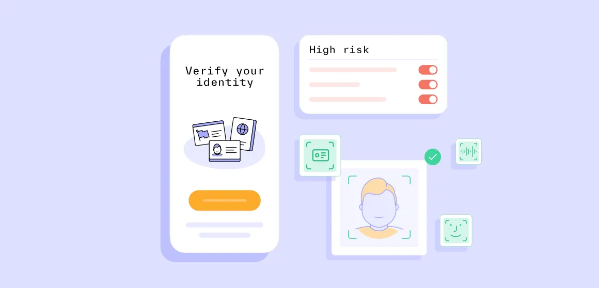
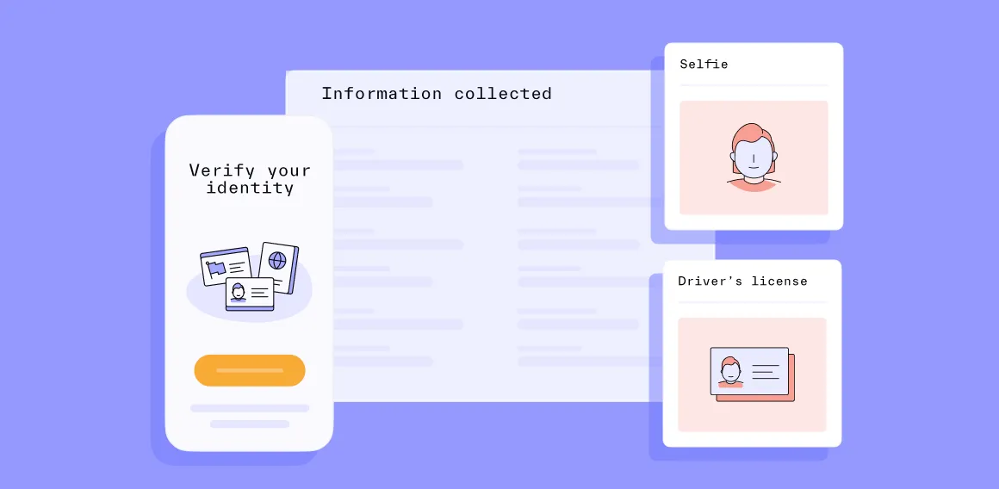

# Know Your Customer and Know Your Workforce

# Know Your Customer and Know Your Workforce

Verify your users to keep bad actors out and legitimate users in. Enforce identity verification throughout the employee life cycle using Persona and Okta’s out-of-the-box integration for identity verification.

# Reach out to our team for a custom demo

Business email address\*

Phone number

InternationalAfghanistanÅland IslandsAlbaniaAlgeriaAmerican SamoaAndorraAngolaAnguillaAntigua and BarbudaArgentinaArmeniaArubaAscension IslandAustraliaAustriaAzerbaijanBahamasBahrainBangladeshBarbadosBelarusBelgiumBelizeBeninBermudaBhutanBoliviaBonaire, Sint Eustatius and SabaBosnia and HerzegovinaBotswanaBrazilBritish Indian Ocean TerritoryBrunei DarussalamBulgariaBurkina FasoBurundiCambodiaCameroonCanadaCape VerdeCayman IslandsCentral African RepublicChadChileChinaChristmas IslandCocos (Keeling) IslandsColombiaComorosCongoCongo, Democratic Republic of theCook IslandsCosta RicaCote d'IvoireCroatiaCubaCuraçaoCyprusCzech RepublicDenmarkDjiboutiDominicaDominican RepublicEcuadorEgyptEl SalvadorEquatorial GuineaEritreaEstoniaEthiopiaFalkland IslandsFaroe IslandsFederated States of MicronesiaFijiFinlandFranceFrench GuianaFrench PolynesiaGabonGambiaGeorgiaGermanyGhanaGibraltarGreeceGreenlandGrenadaGuadeloupeGuamGuatemalaGuernseyGuineaGuinea-BissauGuyanaHaitiHoly See (Vatican City State)HondurasHong KongHungaryIcelandIndiaIndonesiaIranIraqIrelandIsle of ManIsraelItalyJamaicaJapanJerseyJordanKazakhstanKenyaKiribatiKosovoKuwaitKyrgyzstanLaosLatviaLebanonLesothoLiberiaLibyaLiechtensteinLithuaniaLuxembourgMacaoMadagascarMalawiMalaysiaMaldivesMaliMaltaMarshall IslandsMartiniqueMauritaniaMauritiusMayotteMexicoMoldovaMonacoMongoliaMontenegroMontserratMoroccoMozambiqueMyanmarNamibiaNauruNepalNetherlandsNew CaledoniaNew ZealandNicaraguaNigerNigeriaNiueNorfolk IslandNorth KoreaNorth MacedoniaNorthern Mariana IslandsNorwayOmanPakistanPalauPalestinePanamaPapua New GuineaParaguayPeruPhilippinesPolandPortugalPuerto RicoQatarReunionRomaniaRussiaRwandaSaint BarthélemySaint HelenaSaint Kitts and NevisSaint LuciaSaint Martin (French Part)Saint Pierre and MiquelonSaint Vincent and the GrenadinesSamoaSan MarinoSao Tome and PrincipeSaudi ArabiaSenegalSerbiaSeychellesSierra LeoneSingaporeSint MaartenSlovakiaSloveniaSolomon IslandsSomaliaSouth AfricaSouth KoreaSouth SudanSpainSri LankaSudanSurinameSvalbard and Jan MayenSwazilandSwedenSwitzerlandSyriaTaiwanTajikistanTanzaniaThailandTimor-LesteTogoTokelauTongaTrinidad and TobagoTristan da CunhaTunisiaTurkeyTurkmenistanTurks and Caicos IslandsTuvaluUgandaUkraineUnited Arab EmiratesUnited KingdomUnited StatesUruguayUzbekistanVanuatuVenezuelaVietnamVirgin Islands, BritishVirgin Islands, U.S.Wallis and FutunaWestern SaharaYemenZambiaZimbabwe

Anything else?

Submit

By submitting this form, you agree to receive communications at the email address and phone number you provided. See our [Privacy Policy](../legal/privacy-policy.md) for more information about our privacy practices.

Trusted by startups and the world's largest companies

Identity verification with Okta's Identity Cloud = a secure, unified platform + happier users

Workforce Identity Cloud

With the rise of social engineering and deepfake attacks, protecting your distributed workforce is increasingly difficult. Persona adds a crucial layer of security by automatically verifying employees' identities at sensitive moments throughout the employee life cycle, such as new employee onboarding, authentication, and account recovery.

[Read more](https://www.okta.com/integrations/persona-idv/)

Customer Identity Cloud

As a web developer, you can build authentication flows to manage access to your application. But it's way more work to build and manage a verification process, especially as IDs change and your business needs evolve. Persona makes it easy to add automated verification flows to whatever application you're building.

[Read more](https://marketplace.auth0.com/integrations/persona)

Key Persona Features

Workforce Identity Cloud

Tailored verification experiences for your workforce

Offer a seamless verification experience for non-risky users while riskier users have to submit more information..

A robust library of verifications

Combine document and biometric verifications with passive and behavioral signals to enhance identity verification and fraud detection.

Custom retention policies

Control how long workers’ data is stored on Persona.

Out-of-the-box integrations

Easily integrate with Okta and other key productivity platforms.

Key Persona Features

Customer Identity Cloud

Verification flows that adjust in real time to your users

Non-risky users sail through, while riskier users have to submit more information.

Robust library of verifications and signals

Combine document and biometric verifications with passive and behavioral signals to enhance identity verification and fraud detection.

Custom flows without custom code

Design branded flows with a no-code visual editor.

Streamlined identity operations

Follow up with users, update systems of records, and more without painful engineering work.

## Security and privacy at our core

Trust is built on security and privacy. That’s why Persona adheres to the highest industry standards, maintaining compliance and certifications to safeguard you and your customers.

[Learn more](../security.md)

Connect with us

Learn more about how you can protect your organization from social engineering and deepfake attacks during high-risk moments in the employee life cycle.

# Reach out to our team for a custom demo

Business email address\*

Phone number

InternationalAfghanistanÅland IslandsAlbaniaAlgeriaAmerican SamoaAndorraAngolaAnguillaAntigua and BarbudaArgentinaArmeniaArubaAscension IslandAustraliaAustriaAzerbaijanBahamasBahrainBangladeshBarbadosBelarusBelgiumBelizeBeninBermudaBhutanBoliviaBonaire, Sint Eustatius and SabaBosnia and HerzegovinaBotswanaBrazilBritish Indian Ocean TerritoryBrunei DarussalamBulgariaBurkina FasoBurundiCambodiaCameroonCanadaCape VerdeCayman IslandsCentral African RepublicChadChileChinaChristmas IslandCocos (Keeling) IslandsColombiaComorosCongoCongo, Democratic Republic of theCook IslandsCosta RicaCote d'IvoireCroatiaCubaCuraçaoCyprusCzech RepublicDenmarkDjiboutiDominicaDominican RepublicEcuadorEgyptEl SalvadorEquatorial GuineaEritreaEstoniaEthiopiaFalkland IslandsFaroe IslandsFederated States of MicronesiaFijiFinlandFranceFrench GuianaFrench PolynesiaGabonGambiaGeorgiaGermanyGhanaGibraltarGreeceGreenlandGrenadaGuadeloupeGuamGuatemalaGuernseyGuineaGuinea-BissauGuyanaHaitiHoly See (Vatican City State)HondurasHong KongHungaryIcelandIndiaIndonesiaIranIraqIrelandIsle of ManIsraelItalyJamaicaJapanJerseyJordanKazakhstanKenyaKiribatiKosovoKuwaitKyrgyzstanLaosLatviaLebanonLesothoLiberiaLibyaLiechtensteinLithuaniaLuxembourgMacaoMadagascarMalawiMalaysiaMaldivesMaliMaltaMarshall IslandsMartiniqueMauritaniaMauritiusMayotteMexicoMoldovaMonacoMongoliaMontenegroMontserratMoroccoMozambiqueMyanmarNamibiaNauruNepalNetherlandsNew CaledoniaNew ZealandNicaraguaNigerNigeriaNiueNorfolk IslandNorth KoreaNorth MacedoniaNorthern Mariana IslandsNorwayOmanPakistanPalauPalestinePanamaPapua New GuineaParaguayPeruPhilippinesPolandPortugalPuerto RicoQatarReunionRomaniaRussiaRwandaSaint BarthélemySaint HelenaSaint Kitts and NevisSaint LuciaSaint Martin (French Part)Saint Pierre and MiquelonSaint Vincent and the GrenadinesSamoaSan MarinoSao Tome and PrincipeSaudi ArabiaSenegalSerbiaSeychellesSierra LeoneSingaporeSint MaartenSlovakiaSloveniaSolomon IslandsSomaliaSouth AfricaSouth KoreaSouth SudanSpainSri LankaSudanSurinameSvalbard and Jan MayenSwazilandSwedenSwitzerlandSyriaTaiwanTajikistanTanzaniaThailandTimor-LesteTogoTokelauTongaTrinidad and TobagoTristan da CunhaTunisiaTurkeyTurkmenistanTurks and Caicos IslandsTuvaluUgandaUkraineUnited Arab EmiratesUnited KingdomUnited StatesUruguayUzbekistanVanuatuVenezuelaVietnamVirgin Islands, BritishVirgin Islands, U.S.Wallis and FutunaWestern SaharaYemenZambiaZimbabwe

Anything else?

Submit

By submitting this form, you agree to receive communications at the email address and phone number you provided. See our [Privacy Policy](../legal/privacy-policy.md) for more information about our privacy practices.

Trusted by startups and the world’s largest companies

